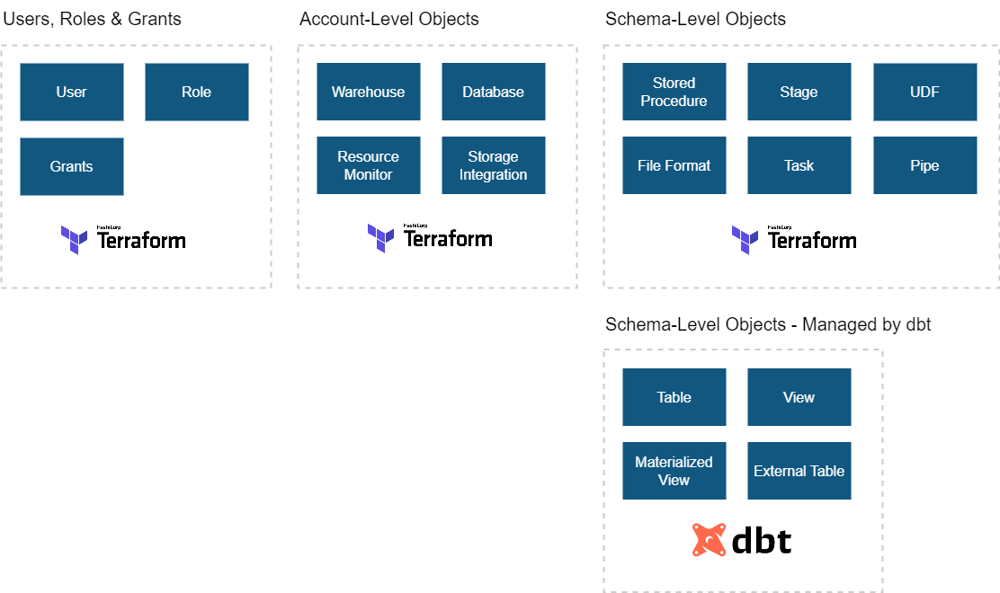

# DM - Snowflake Version Control using Terraform

## 1. Overview

This repository contains Terraform configuration files used to version control Snowflake objects.

> [!NOTE]
>
> **What is Terraform?** See [What is Terraform?](docs/terraform_background/terraform_background.md)

---

## 2. How to Use this Repo

For instructions on how to use this repo, see [How to use this repo](docs/how_to_use_this_repo.md).

### 2.1. Example: Create a Snowflake Database using Terraform

For a step-by-step example, refer to [How to Create Snowflake Objects using Terraform](docs/example_how_to_create_sf_db_using_terraform.md).

---

## 3. Snowflake Object Types

Shown below is an overview of the different Snowflake object types as described in the following link: [A New Approach to Database Change Management with Snowflake \| Medium.com](https://jeremiahhansen.medium.com/a-new-approach-to-database-change-management-with-snowflake-8e3f0fee281).

* This object structure is replicated for each of the account-level objects created underneath `terraform/environments/<ENV>/`.
* As such, identify the type of object you're creating and place it in the appropriate subdirectory.

---

## 4. Prerequisites for Repository Setup (For Repo Maintainers)

If you're setting up this repository for the first time or maintaining it, refer to the [setup prerequisites](docs/setup.md) guide for:

- Installing Terraform and related tools.
- Configuring environment variables.
- Setting up the Snowflake service account and roles.

End-users can skip this section; it’s for maintainers only.

---

## 5. Help

| Theme               | Question                                        | Answer                                                                                                       |
|---------------------|------------------------------------------------|--------------------------------------------------------------------------------------------------------------|
| Local Dev Environment | How do I set up a local Terraform dev environment? | See [Local Development Instructions for 'Terraforming Snowflake'](docs/local_dev_instructs_terraforming_snowflake.md) |
