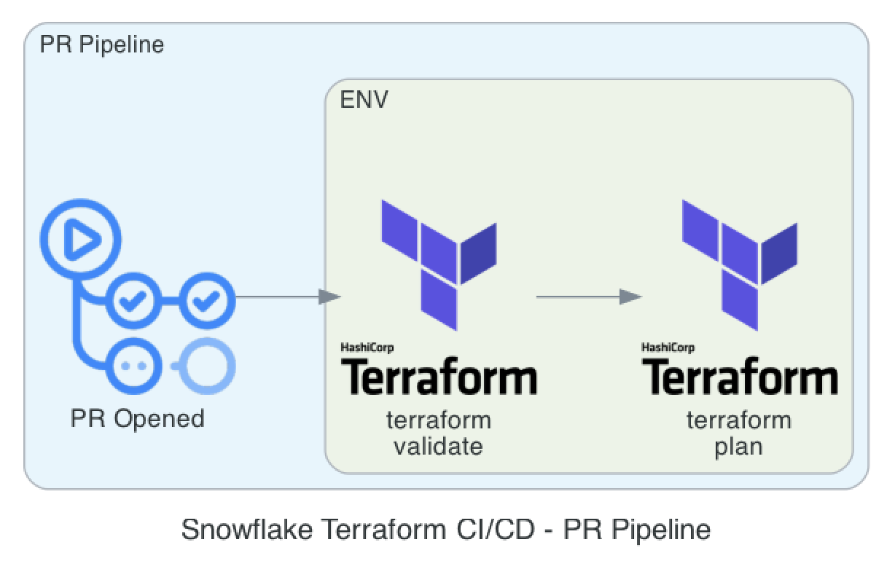
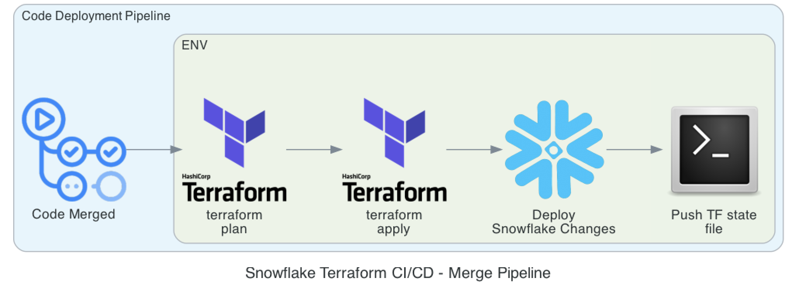

# CI/CD Pipelines for Terraforming Snowflake

Described below are the two CI/CD pipelines used within the repo.

## Pull Request (PR) Pipeline

### Purpose:

* Validate the proposed Terraform code, using the commands:
  * `terraform init`
  * `terraform validate`
  * `terraform plan`
* The PR pipeline is triggered when a PR is opened.

### Steps (PR Pipeline):

1. **`terraform init`**: Runs `terraform init` command to initialise the Terraform project.
2. **`terraform validate`**: Runs `terraform validate` command to validate the Terraform config files.
3. **`terraform plan`**: Runs `terraform plan` command to generate an execution plan for the proposed changes.

The scripts used for this pipeline can be found here: [../.github/actions/pr_pipeline_terraform_validate_and_plan/action.yml](../.github/actions/pr_pipeline_terraform_validate_and_plan/action.yml).

---

## Code Deployment Pipeline

### Purpose:

* Deploys Snowflake changes using the commands:
  * `terraform init`
  * `terraform plan`
  * `terraform apply`
* The pipeline is triggered when code is merged into the main branch.

### Steps:

1. **`terraform init`**: Runs `terraform init` command to initialise the Terraform project.
2. **`terraform plan`**: Runs `terraform plan` command to generate an execution plan for the proposed changes.
3. **`terraform apply`**: Runs `terraform apply` to apply the Terraform changes.
4. **Push Terraform State**: Updates the Terraform state file via a bash script.

The scripts used for this pipeline can be found here: [../.github/actions/code_deployment_terraform_apply/action.yml](../.github/actions/code_deployment_terraform_apply/action.yml).
