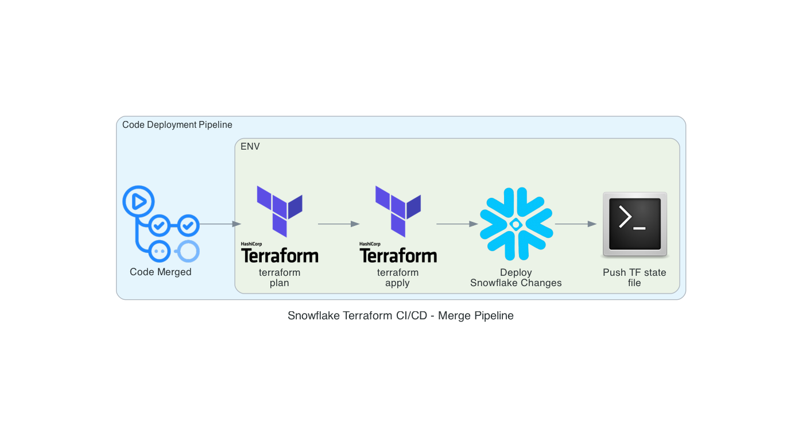

# CI/CD Pipelines for Terraforming Snowflake

This document outlines the Pull Request (PR) and Code Deployment pipelines in the `terraforming_snowflake` repository.

---

## Pull Request (PR) Pipeline

Triggered when a PR is opened, this pipeline validates Terraform code and generates a plan for review.

### Steps (PR Pipeline):

1. **Trigger**: Activated on PR creation.
2. **Terraform Validate**: Ensures Terraform configuration is syntactically correct.
3. **Terraform Plan**: Generates an execution plan for proposed changes.

---

## Code Deployment Pipeline

Triggered when code is merged into the main branch, this pipeline applies Terraform changes and deploys updates to Snowflake.

### Steps:

1. **Trigger**: Activated on code merge.
2. **Terraform Plan**: Confirms changes to be applied.
3. **Terraform Apply**: Applies infrastructure changes.
4. **Snowflake Deployment**: Deploys updates to Snowflake.
5. **Push Terraform State**: Updates the Terraform state file via a bash script.

