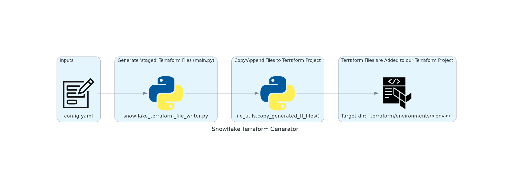

# Snowflake Terraform Generator

This script automates the generation of Terraform `.tf` files for Snowflake environments, based on structured inputs defined in `inputs/config.yaml`.

It enables teams to standardise the creation of Snowflake environments, including databases, warehouses, schemas, and roles, following consistent naming conventions.

---

## 🚀 How to Execute

Run the script from the command line:

```bash
python main.py
````

Optional flags:

| Flag               | Description                                                                                          |
| ------------------ | ---------------------------------------------------------------------------------------------------- |
| `--dry-run`        | Simulates copying files to `terraform/environments/` without modifying anything                      |
| `--on-file-exists` | Specifies behaviour when a file already exists: `overwrite`, `append`, `skip`, or `prompt` (default) |

Example:

```bash
python main.py --on-file-exists overwrite
```

---

## 🧩 What This Script Generates

When executed, the script will generate Terraform files for the following **per environment** (e.g., `dev`, `uat`, `prod`) as defined in `inputs/config.yaml`:

### 1. A New Snowflake Database (per-env)

* Named using the format: `<project>_<env>`, e.g. `DQ_DEV`
* Created **once per environment** specified
* Includes any additional schemas listed in the `schemas` config section

### 2. A New Snowflake Warehouse (per-env)

* Named using the format: `<project>_<env>_WH`, e.g. `DQ_DEV_WH`
* Multiple warehouses can be specified per project

### 3. Snowflake Roles (per-env)

The script generates:

* A standard set of functional roles (based on `functional_roles` input)
* Two additional roles per environment:

  * `<project>_<env>_ALL_ROLE` — Full access and ownership
  * `<project>_<env>_SEL_ROLE` — Read-only access

---

## 📁 Required Inputs: `inputs/config.yaml`

You must populate the `config.yaml` file with your project-specific inputs before running the script.

### Example:

```yaml
project: DQ
environments:
  - dev

create_database: true

schemas:
  - DQ_PLATFORM
  - DQ_DATA_LAKE

warehouses:
  - DQ

functional_roles:
  - MAINAINER
```

### Input Field Reference

| Key                | Required    | Description                                                                  |
| ------------------ | ----------- | ---------------------------------------------------------------------------- |
| `project`          | ✅ Yes       | Short name or code for the project; used in resource naming                  |
| `environments`     | ✅ Yes       | List of environments to generate resources for (e.g. `dev`, `uat`, `prod`)   |
| `create_database`  | ⚠️ Optional | Whether to generate Terraform to create the database (`true` or `false`)     |
| `schemas`          | ✅ Yes       | List of Snowflake schemas to create within the database                      |
| `warehouses`       | ✅ Yes       | List of warehouses to create (if any)                                        |
| `functional_roles` | ✅ Yes       | List of functional roles to create (e.g. access patterns like `VIEW_RUNNER`) |

---

## 📊 Snowflake Terraform Generator – Flow Diagram

This diagram illustrates the core components and execution flow of the Snowflake Terraform Generator.



---

## 🧠 Naming Conventions

This script enforces standard naming conventions for Snowflake and Terraform resources.

🔗 Refer to the full naming convention spec here:
➡️ [Snowflake & Terraform Naming Conventions](../../../docs/naming-conventions.md)

Examples (PROJECT = `OPERATIONS`, ENV = `PROD`):

| Resource Type       | Naming Convention                  | Example                                 |
| ------------------- | ---------------------------------- | --------------------------------------- |
| Database            | `<PROJECT>_<ENV>`                  | `OPERATIONS_PROD`                       |
| Schema              | As listed in YAML                  | `DQ_PLATFORM`                           |
| Warehouse           | `<PROJECT>_<ENV>_WH`               | `OPERATIONS_PROD_WH`                    |
| DB "All" Role       | `<PROJECT>_<ENV>_ALL_ROLE`         | `OPERATIONS_PROD_ALL_ROLE`              |
| DB "Read-Only" Role | `<PROJECT>_<ENV>_SEL_ROLE`         | `OPERATIONS_PROD_SEL_ROLE`              |
| Functional Roles    | `FUNC_<PROJECT>_<ENV>_<ROLE>_ROLE` | `FUNC_OPERATIONS_MAINTAINER_ROLE` |

Terraform resource names also follow structured prefixes like `db_`, `role_`, or `wh_` for consistency and clarity.
